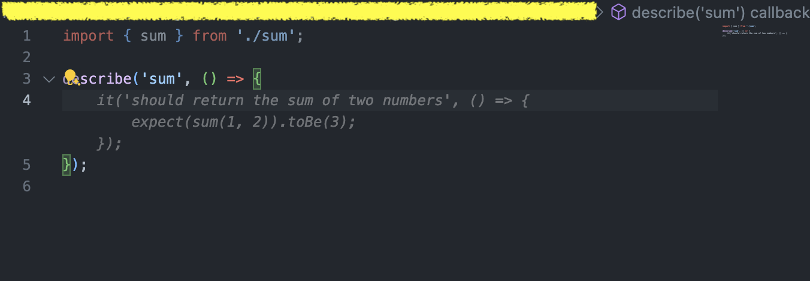
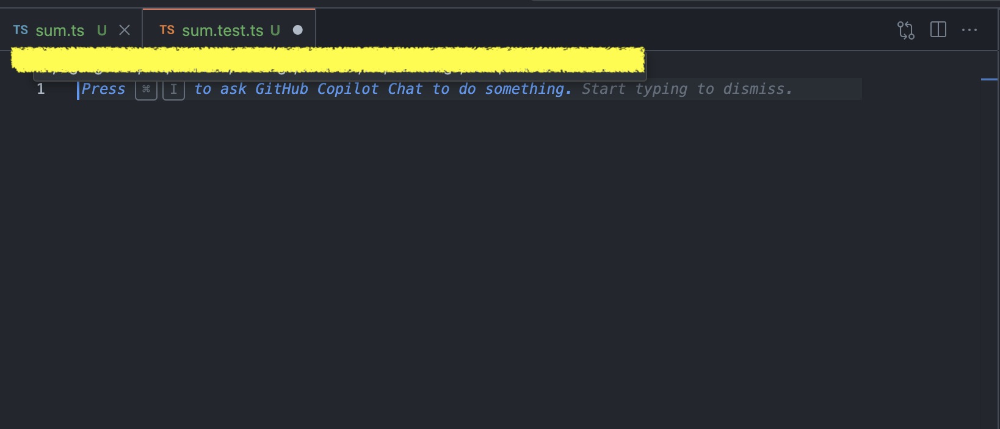

### 1. 테스트 코드 작성이 쉬워진다

    테스트코드는 입력값과 결과값이 정해져 있는 명제이다. 간한히 다음과 같은 `sum` 함수가 있다고 가정해보자.
    ```tsx title=sum.ts
    function sum(a: number, b: number): number {
        return a + b;
    }

    ```
    vscode에서 `sum` 함수를 테스트 하려고 하면 다음처럼 코드가 자동완성 된다.
    ```tsx title=sum.test.ts
    import { sum } from './sum';
 
    describe('sum', () => {
        it('should return the sum of two numbers', () => {
            expect(sum(1, 2)).toBe(3);
        });
    });

    ```
    
    개발자가 작성해야 할 코드는 사실상 sum을 import하는 코드 한줄이다. 코파일럿이 파일명과 import한 함수명을 보고 테스트 코드를 작성해주었다.
    조금 더 쉬운 WOW한 방법을 사용해보자

    
    

    그냥 처음부터 만들어달라고 하면 된다!

    그냥 간한한 함수만 테스트가 가능한거 아니야? 라고 생각할 수도 있지만, 다음처럼 react-hook을 테스트 하는 코드도 쉽게 작성해준다.
    ```tsx title=useCounter.tsx
    import { useState } from 'react';
    
    export function useCounter() {
        const [count, setCount] = useState(0);
        const increment = () => setCount(count + 1);
        const decrement = () => setCount(count - 1);
        return { count, increment, decrement };
    }
    ```

    ```ts title=useCounter.test.ts
    import { renderHook, act } from '@testing-library/react-hooks';
    import { useCounter } from './useCounter';

    describe('useCounter', () => {
        it('should increment count', () => {
            const { result } = renderHook(() => useCounter());
            act(() => {
                result.current.increment();
            });
            expect(result.current.count).toBe(1);
        });

        it('should decrement count', () => {
            const { result } = renderHook(() => useCounter());
            act(() => {
                result.current.decrement();
            });
            expect(result.current.count).toBe(-1);
        });
    });
    ```

    만약 테스트코드 작성을 공부해야하는 입장이 아니라면 모든 개발자가 코파일럿을 이용해서 테스트코드를 작성하길 바라는 마음까지 든다.


### 2. 코드 유추를 통해 자동완성이 가능해진다.
    다음 배열에서 숫자만 추출하는 코드를 작성해보자.
    ```ts
    const some_arrays = [1, 2, 3, null, 4, 5, null, 6, 7, 8, null, 9, 10, 'happy', 'sad'];
    ```
    변수명은 `only_numbers`로 하고싶다.

    


    `only_numbers`를 가진 변수를 설정하면 `some_arrays.filter((item) => typeof item === 'number')`가 자동완성 된다.
    
    css 코드를 작성할때도 얼마나 유용한지 보자

    ```CSS
    .center_container {
        display: flex;
        justify-content: center;
        align-items: center;
        height: 100%;
        width: 100%;
    }

    .grid_container {
        display: grid;
        grid-template-columns: repeat(auto-fill, minmax(200px, 1fr));
        grid-gap: 1rem;
        padding: 1rem;
    }
    ```
    여기서 개발자가 해준 것은 `center_container`와 `grid_container`의 이름을 만들어 준 것이 전부이다. 나머지는 클래스명을 유추한 코파일럿이 알아서 해준다.


### 3. 아 모르겠다 그냥 너가 코딩해!
    위에서 사용한 예제를 다시 한번 보자
    ```ts
    const some_arrays = [1, 2, 3, null, 4, 5, null, 6, 7, 8, null, 9, 10, 'happy', 'sad'];
    ```
    여기서 nullish한값을 제거하고싶다. 위에처럼 변수명을 통해 유추하게 만들어도 되지만 주석을 이용해서 다음처럼 입력해보자.

    ```ts
    const some_arrays = [1, 2, 3, null, 4, 5, null, 6, 7, 8, null, 9, 10, 'happy', 'sad'];
    // filter out null values
    ```

<div
  style={{
    width: "100%",
    display: "flex",
    justifyContent: "center",
    alignItems: "center",
    marginTop: "20px",
  }}
>
  <figure>
    
    <figcaption>자동으로 완성되는 코드</figcaption>
  </figure>
</div>

### 4. 이제는 더 이상 구글링이 필요없을지도?
코파일럿을 vscode와 연동하면 왼쪽 익스텐션 패널에서 코파일럿 채팅을 사용할 수 있다. 이를 통해 구글링을 하지 않고도 원하는 답변을 찾을 수 있다. 이는 Chat-GPT를 사용하는 방법과 비슷할텐데 에디터에서 사용할 수 있다는 점이 상당히 편하다.


### 마치며

위 내용만 보면 코파일럿을 쓰지 않을 이유가 없다(유료이긴 하다).
여기서는 간단한 코드만으로 설명해서 그렇지만, 실제로는 더 복잡한 코드를 작성하다 보면 코파일럿의 정확성은 100%가 아니다. 하지만 개발자의 효율성을 높여주는 도구로서 코파일럿의 가치는 충분히 높다.
많은 개발자들이 코파일럿을 사용하고 나보다 더 좋은 활용법을 알아내서 쉽게 개발 하길 바란다.


