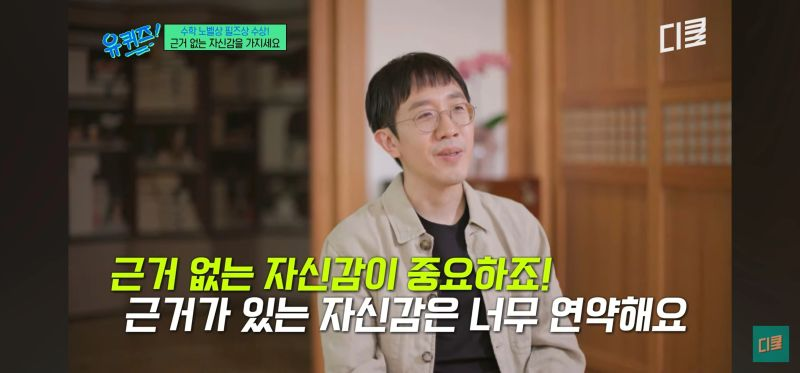

스타트업에 오고 나서 풀스택으로 서비스를 배포하거나 회사에 필요한 툴들을 직접 만드는 등 다양한 일을 하고 있다.
예전에는 한 사람이 모든 걸 다루기 어려웠던 영역들이었지만, 요즘은 AI 덕분에 훨씬 가볍게 접근할 수 있게 됐다.

시간이 오래 걸리던 작업도 금세 끝나고, 혼자서는 엄두도 못 냈던 기능도 만들어볼 수 있다.
물론 백엔드나 인프라를 완전히 모르는 건 아니었지만, 그땐 “이건 내 역할이 아니니까” 하고 선을 그었던 일들이었다.

**AI가 만들어준 건 ‘효율’보다 ‘자신감’이다.**

스타트업은 원래 불확실하다. 정답도 없고, 자원은 항상 부족하다.
그 안에서 필요한 건 완벽한 기술보다 새로운 걸 시도해보려는 태도라고 생각한다.

하루아침에 망할 수도 있는 환경 속에서 중요한 건 문제를 정확히 보고, 필요한 부분을 핀포인트로 고치려는 자세다.
그리고 회사나 스스로에게 한계를 두지 않는 실험정신과 도전정신.

AI는 개발자의 역할을 없애지 않았다. 오히려 “어디까지 해볼 수 있는가”의 기준을 완전히 바꿔놓았다.

개발자로서 기술력을 키우는 것도 중요하지만 요즘은 빠르게 변하는 세상 속에서 한 발 더 나아가려는 마음과 스스로 한계를 정하지 않는 마음을 갖는 것이 더 중요하다고 생각한다.

누군가는 “프론트엔드라면 UI만 잘 만들면 되지 않나?”라고 말하지만 이제는 그보다 훨씬 많은 것들을 연결할 수 있는 시대다.

사용자 경험을 고민하다 보면 자연스럽게 기획으로 이어지고, 비즈니스의 흐름을 이해해야 더 나은 기술적 판단을 내릴 수 있다.
지금의 개발자는 더 이상 하나의 역할에 머무는 사람이 아니다.

스타트업이든 대기업이든,
모두가 새로운 도구와 환경 속에서
자신의 한계를 계속 넓혀가고 있다.

AI가 바꾼 건 일에 대한 태도다. 이제는 “할 수 있을까?” 대신 **“한번 해볼까?”** 라고 말하게 됐다.
