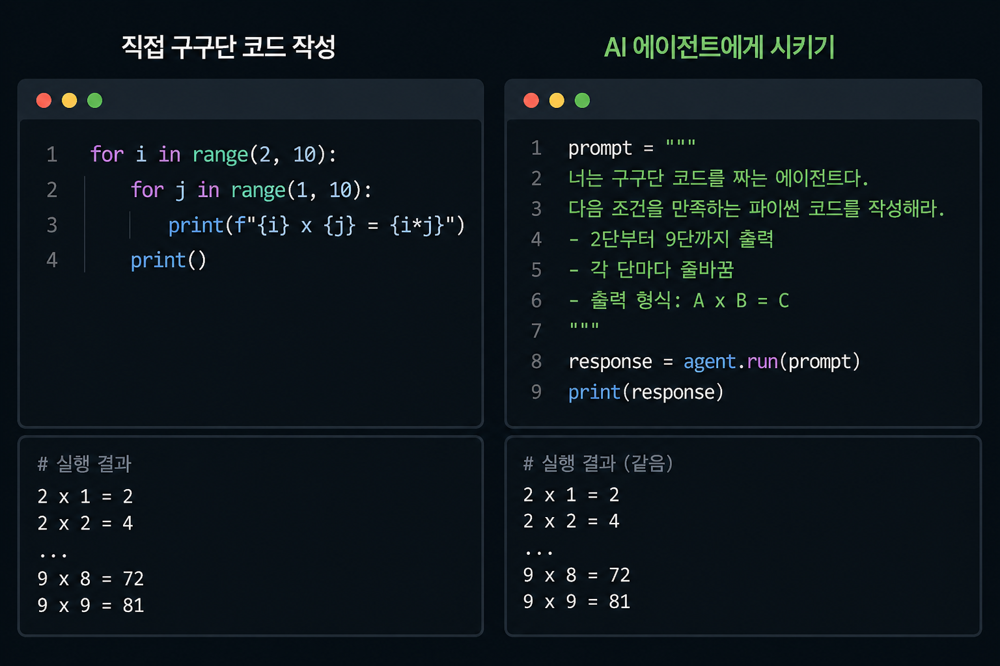

사실 저는 얼마 전까지만 해도, 개발자는 결국 사라질 거라고 생각했던 사람이었습니다.

그 생각이 바뀐 건, 아이러니하게도 AI 엔지니어로 일해보면서였습니다.

최근 한 달 동안 AI 엔지니어로 일하면서, 지금까지 해왔던 개발이랑은 완전히 다른 일을 했습니다.

기능을 만드는 게 아니라, LLM이 만든 결과가 맞는지 검증하고 "이걸 믿어도 되는지"를 판단하는 시스템을 만드는 일이었습니다.

제가 맡았던 건 LLM의 할루시네이션을 평가하는 일이었습니다.

사람이 보면 금방 판단할 수 있는 것들이지만, 계속 사람이 하기엔 너무 반복적이고 비효율적이라 LLM이 대신 수행하도록 구조를 만들었습니다.

그리고 그 결과를 다시 검증하는 평가 시스템까지 함께 구축했습니다.

여기까지 보면 "이제 진짜 개발자 필요 없어지는 거 아닌가?"라는 생각이 들 수도 있습니다.

근데 실제로 해보니까 정반대였습니다.

말로 들으면 간단해 보이는데, 막상 해보니까 전혀 아니었습니다.

정답지를 만드는 것부터, "어디까지 맞다고 볼 것인가" 기준을 정하는 것까지 생각보다 훨씬 어려운 문제들이 많았습니다.

거의 10년 동안 일을 했지만, 다시 1년 차로 돌아가 처음부터 배우는 느낌이었습니다.

그리고 더 흥미로웠던 건, 이런 문제들을 결국 풀어낸 사람들이
AI 전공자나 AI를 오래 다뤄본 사람이 아니라, 그냥 원래 잘하던 개발자들이었다는 점이었습니다.

도구는 바뀌었지만, 문제를 정의하고 방향을 잡는 능력은 그대로 중요했습니다.

아마 앞으로는
for문으로 구구단을 짜기보다는
"구구단 코드 만들어줘"라고 시키는 코드(?)가 프로젝트 곳곳에 들어가게 될지도 모르겠습니다.

그래서 더 아이러니하게 느껴졌습니다.

개발자를 대체할 것 같았던 기술을 가까이서 다뤄볼수록,
오히려 개발자의 역할이 더 또렷하게 보였기 때문입니다.

이제는 "개발자가 없어질까?"라는 생각보다는,
"어떤 개발자가 살아남을까?"를 더 많이 고민하게 됩니다.

제품을 만드는 일도 결국 AI가 대신하게 되는 건 아닐까 하는 고민으로, 여러 시도와 경험을 해왔습니다.

그런데 아이러니하게도, 이 일을 계기로 오히려 확신이 들었습니다.

좋은 제품을 만드는 데에는 여전히 좋은 개발자가 필요하다는 것을요.

그래서 저는 다시, 제가 잘할 수 있고 좋아하는 일로 돌아가 보려고 합니다.

AI를 도구로 삼아서, 더 나은 제품을 만드는 개발자로요.
